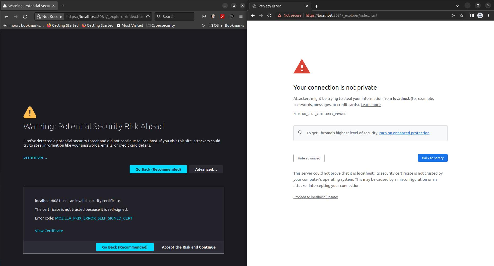

# Run and Connect to Cosmos from a Docker Container

This project will demonstrate how to run a local Docker emulator and connect to the Cosmos instance from a .NET project.

## Running the Docker emulator

You can run the Docker instance by running the following script: `./env/local/_up.sh`. This will execute `docker-compose` on the `docker-compose.local.yml` file. This will fetch the Cosmos emulator image from Microsoft's container repository and run the Docker emulator on port `8081`.

## Browse the Cosmos emualtor

To browse the Cosmos emulator once the Cosmos Docker container is running, you can open `https://localhost:8081/_explorer/index.html` in your browser. You may receive a security warning regarding a potential security risk.

This risk can be averted by exporting the emulator's certificate into your certificat keychain as [documented by Microsoft](https://docs.microsoft.com/en-us/azure/cosmos-db/linux-emulator?tabs=sql-api%2Cssl-netstd21#run-the-linux-emulator-on-linux-os), but this process can vary depending on your operating system. So, you can either accept the risk and continue or you can export the emulator's certificate and import it into your keychain. A future enhancement item for this project would be to come up with an automated way to do this.

## Connect to Cosmos from the .NET project

Once the Cosmos Docker container is running, we should be able to run our .NET Project. Open up the `TestCosmosDocker.sln` solution under `TestCosmosDocker`. The `Program.cs` file has code that will do the following:

1. Connect to the Cosmos instance using a CosmosClient
2. Create a database called `test-database`, if it doesn't already exist
3. Within the database, create a container called `MyContainer`, if it doesn't already exist.
4. Create a `CosmosContext` DbContext our code can use to perform work on
5. Insert a record into `MyContainer`
6. Fetch the record from `MyContainer`
7. Delete the record from `MyContainer`

**NOTE**: As noted in the code, in order to bypass SSL validation on the Cosmos connection, custom options were supplied to the Cosmos contexts to suppress SSL validation as suggested by [Microsoft's documentation](https://docs.microsoft.com/en-us/azure/cosmos-db/local-emulator?tabs=ssl-netstd21#disable-ssl-validation). This is ***only*** to be done for local development, and should not be used in a production environment. 